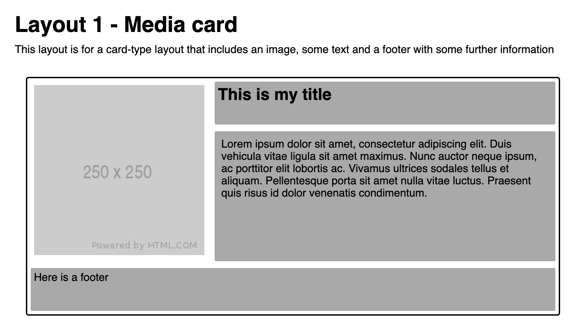
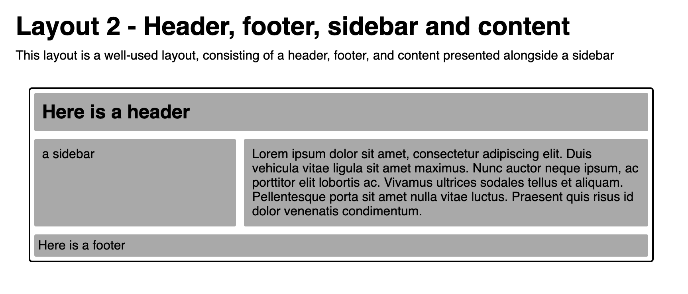
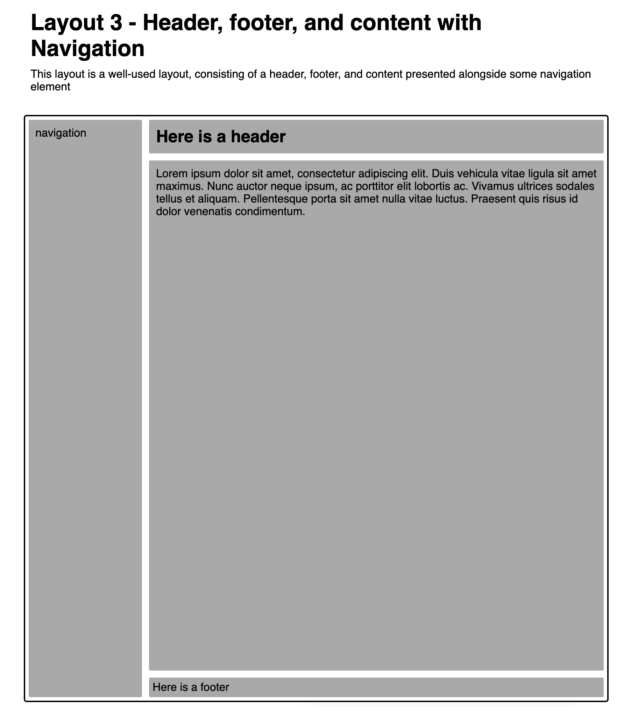

+++
title="Lab Exercise: CSS Layout"
weight = 3
+++

The task in this lab session is to work in your groups to practice using the CSS layout techniques we've been looking at for the last few weeks

**One person** should take the lead with coding, and the other(s) act as reviewers and editors, helping the lead coder create the code: suggesting solutions for implementation, watching for typos and minor errors, and providing feedback and evaluation.

### This week's task

You should look at the CSS layouts below and attempt to build each one using as many different layout techniques as possible. You can use floats, flexbox, CSS-Grid, absolute/relative positioning, whatever methods you like. You should try to minimise the amount of CSS code required. 

*   As you build each version of the layout, pay attention to how difficult it is, how much code it needs, and how responsive the resulting layout is. 
*  Can you make the layout fully responsive?
*  How many different ways can you find to build each layout?

#### Layout 1

#### Layout 2

#### Layout 3

