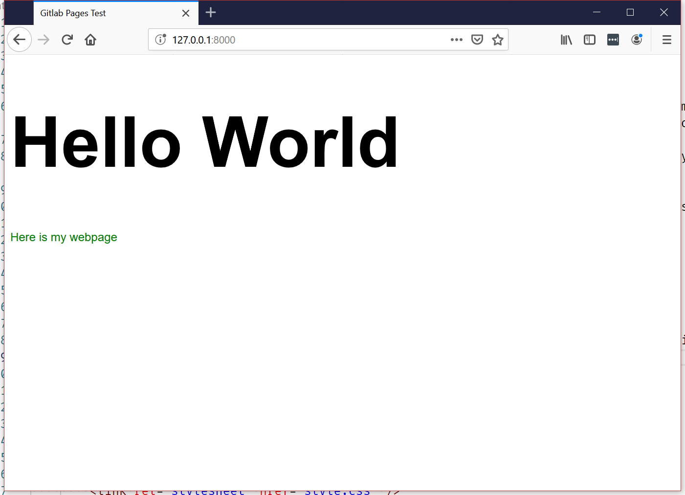
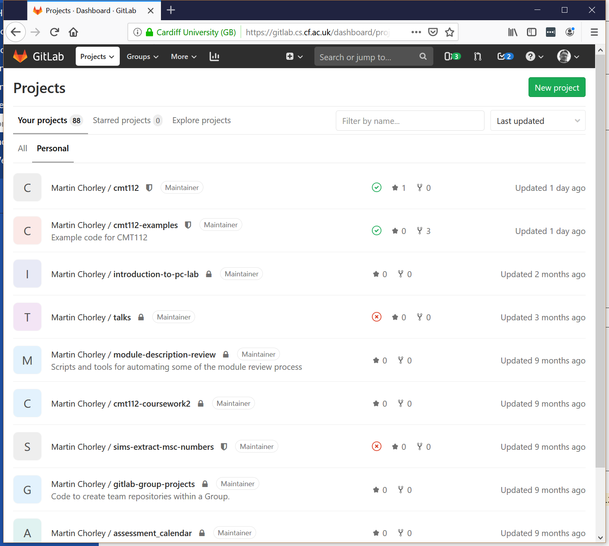
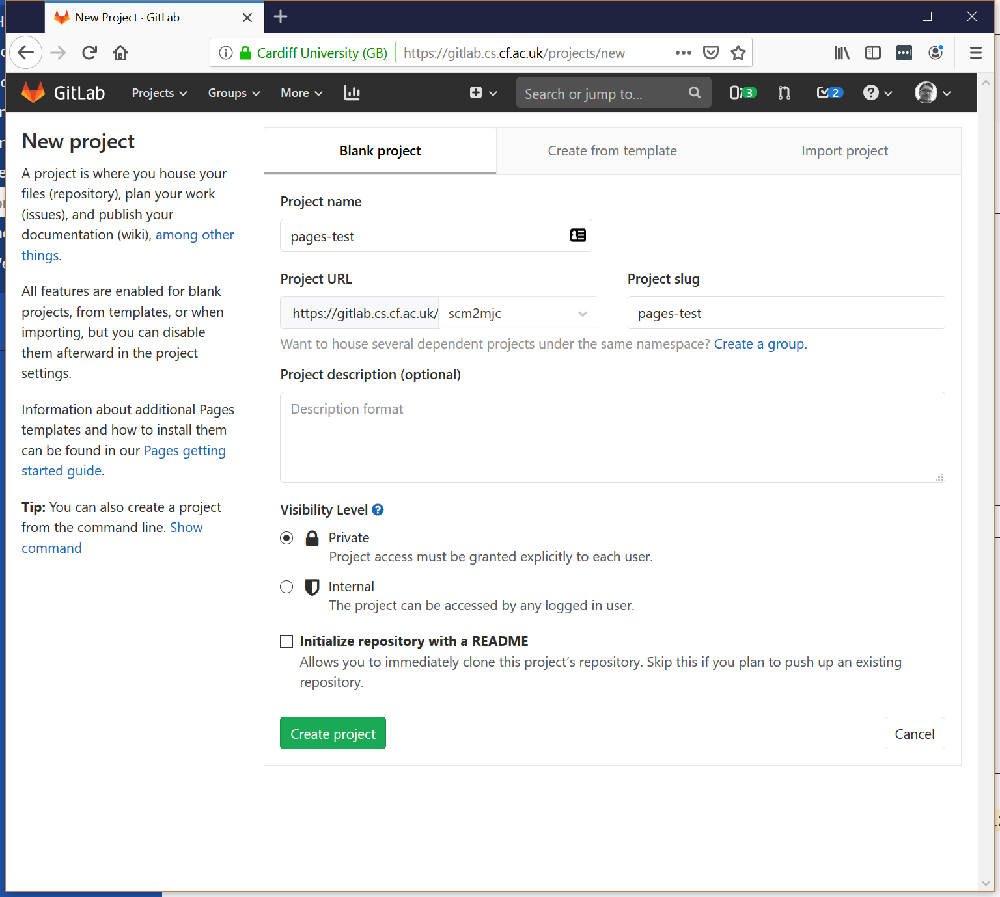
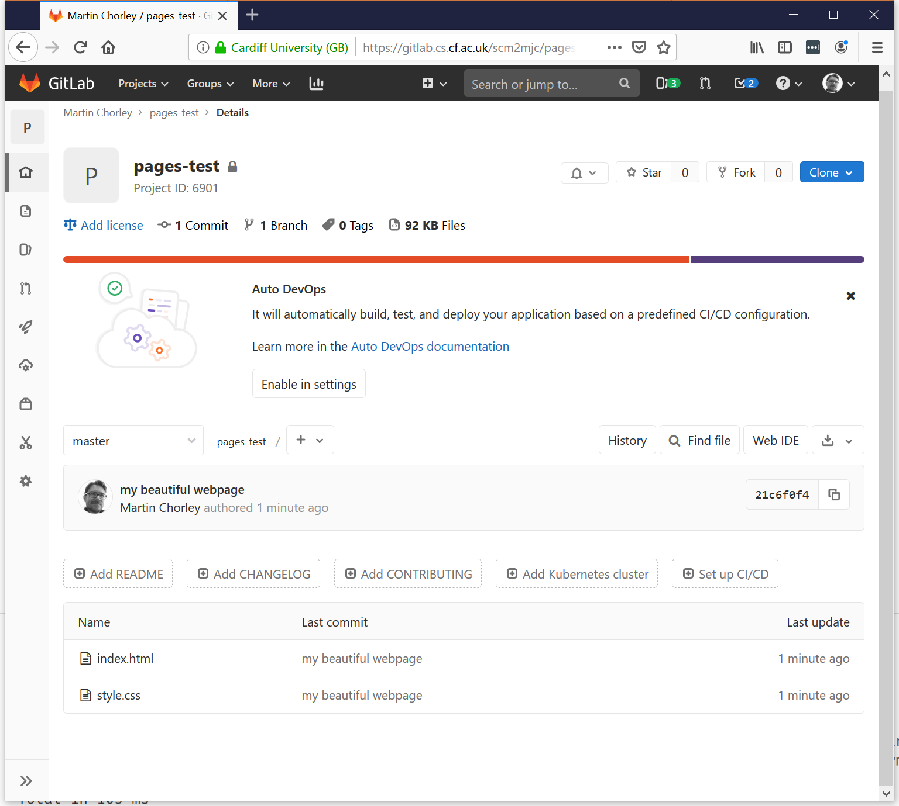
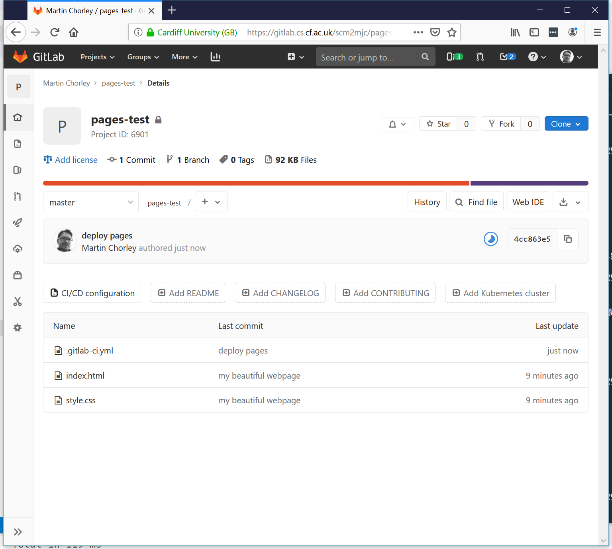
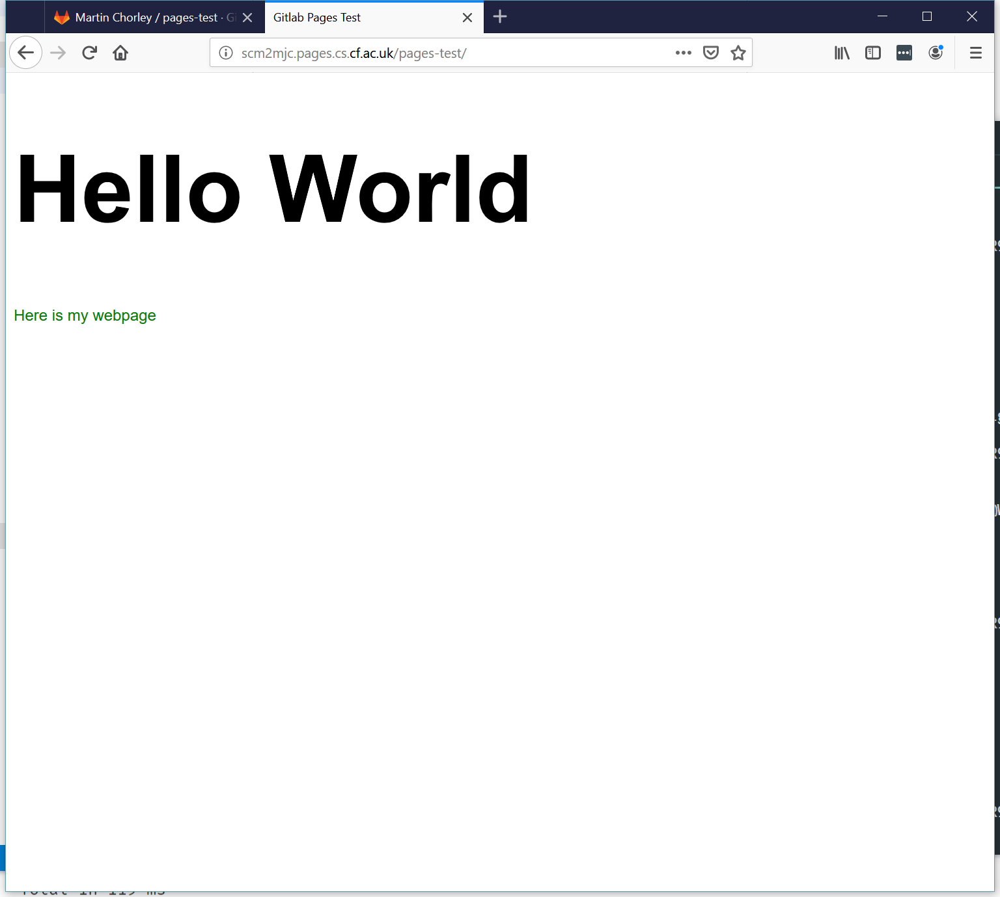

+++
title="Hosting on Gitlab Pages"
weight = 5
+++

At some point while we are developing webpages, we are probably going to want to put them on the Internet for other people to see/use. One of the easiest ways of doing this is to use hosting that is available through the same services we are already using to version control our code.

The School's GitLab server has functionality enabled that allows us to easily and quickly host our webpages, and for them to automatically update whenever we `push` changes to our remote Git repository. Lets see this in action.

First, let's create a basic webpage. We start the same was as in the Introductory exercise, by creating a folder and initialising an empty Git repository:

```bash
mkdir pages-test
cd pages-test
git init .
```

Then, in our `pages-test` folder we can create a simple HTML page and a CSS file to go with it:

```html
<!DOCTYPE html>
<html lang="en">
    <head>
        <meta charset="UTF-8" />
        <meta name="viewport" content="width=device-width, initial-scale=1.0" />
        <meta http-equiv="X-UA-Compatible" content="ie=edge" />
        <link rel="stylesheet" href="style.css" />
        <title>Gitlab Pages Test</title>
    </head>
    <body>
        <h1>Hello World</h1>
        <p>Here is my webpage</p>
    </body>
</html>
```

```css
body {
    font-family: Arial, Helvetica, sans-serif;
}

h1 {
    font-size: 6em;
}

p {
    color: green;
}
```

We start a server in the same folder as our `index.html` file (`python3 -m http.server`), open `127.0.0.1:8000` in a web browser, and take a look at our masterpiece:



This website is glorious, and we wouldn't want to lose it if our laptop suddenly died so let's store a snapshot of it in our Git repository, and then store a copy of that Git repository online.

First, we add our files to the local repository and commit their current state:

```bash
git add .
git commit -m 'my beautiful webpage'
```

Then, we go to [gitlab.cs.cf.ac.uk](gitlab.cs.cf.ac.uk) and create a remote project in which we can store a copy of this repository, by clicking the big green 'New project' button:



We give our project a name, can change the visibility if we like, and create the new project by clicking the big green 'Create project' button



Now we need to link our local repository with the remote repository in our gitlab project. To do that, we can follow the instructions Gitlab gives us under 'Push an existing folder' on the new project page, but we don't need to initialise the repository, or commit the files as we've already done that:

```bash
git remote add origin git@gitlab.cs.cf.ac.uk:scm2mjc/pages-test.git
git push -u origin master
```

If we refresh the project page on Gitlab now, we will see that our repository is safely stored in our Gitlab project. This means that not only are the latest copy of our files available there, but over time (as long as we keep pusing changes to the remote server) our entire history will be safely stored.



Now our code is in our repository and we are linked to a remote Gitlab project, we can enable the Gitlab pages functionality so that our page will be hosted and available online. This uses part of Gitlab's functionality called CI/CD - which stands for Continuous Integration/Continuous Deployment. Later you can use this to automate things like testing your code whenever you push a new commit, but for now we'll just use it to automate the deployment of our website to the Gitlab pages server.

To do this, we add a file called `.gitlab-ci.yml` to our repository. This special file is read by Gitlab on every push so it can work out what CI/CD tasks it needs to run. Our `.gitlab-ci.yml` file is just going to create a task that will copy our website to the Gitlab pages server:

```yaml
image: alpine:latest

pages:
    stage: deploy
    script:
        - mkdir .public
        - cp -r * .public
        - mv .public public
    artifacts:
        paths:
            - public
    only:
        - master
```

You don't really need to worry about the details of this file at this point, just know that it works.

Let's add this file to our repository, and push the changes to the remote Gitlab project:

```bash
git add .gitlab-ci.yml
git commit -m 'deploy pages'
git push
```

If you quickly refresh your project page on Gitlab, you will see that adding this file and pushing it to your project has triggered a process on Gitlab.You can see a half filled circle next to the message about the latest commit, which indicates that a build process is running:



Once this process is complete, the blue icon will (hopefully!) change to a green tick, to indicate the process has finished successfully:


Your webpage should then be published at yourusername.pages.cs.cf.ac.uk/your-project-name:



Now, every time you make a change to your local copy of the webpage, if you add it to your repository, commit the change, and sync to the remote server, the Gitlab CI process will run and publish those changes automatically. How neat!
