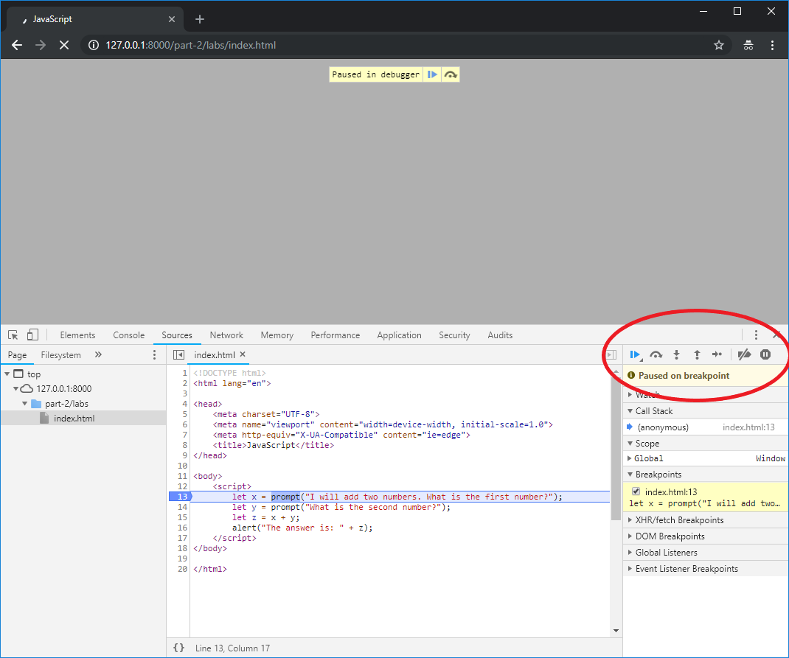
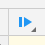

+++
title="Lab Exercise - Forms & JavaScript Events"
draft=false
+++

We are now going to start to look at dynamically updating our pages using JavaScript, reacting to JavaScript events, and capturing information from the User using Form elements. We will also learn how to use the built-in tools in our browser to monitor how our code executes, and how to debug problems.

{}
You will need to use Google Chrome for the coding exercises in this week's lab sheet.
{}

**One person** should take the lead with coding, and the other(s) act as reviewers and editors, helping the lead coder create the code: suggesting solutions for implementation, watching for typos and minor errors, and providing feedback and evaluation. You will also be using Git for version control for the code on this exercise, and will share it to GitLab so that your entire group has access to the final code.

### JavaScript Debugging

Create an `index.html` file for this week in a text editor, and at the same time, open it in Google Chrome.

{}
You will also need the `Developer Tools` window open in Chrome
{}

In the text editor, enter the following code for your index.html page:

```html
<!DOCTYPE html>
<html lang="en">
    <head>
        <meta charset="UTF-8" />
        <meta name="viewport" content="width=device-width, initial-scale=1.0" />
        <title>JavaScript</title>
    </head>

    <body>
        <script>
            let x = prompt("I will add two numbers. What is the first number?");
            let y = prompt("What is the second number?");
            let z = x + y;
            alert("The answer is: " + z);
        </script>
    </body>
</html>
```

Reload the page, and enter a number in the prompt box when requested. Pay attention to the answer in the alert box. Is it what you expected?

Lets use the debugger to see what's going on and try to figure out why we are getting the wrong answer. In the Developer Tools window in Google Chrome, click on the 'Sources' tab. in the left-hand pane you can see all the files that make up your webpage - in this case 'index.html'. This may already be selected, but if not select this file, and the source code will appear in the middle pane.


In order to see what is going on, we need to set a 'breakpoint'. A breakpoint allows us to pause our code at a particular point, or during a particular event. We can then have a look at the internal **state** of our program to see what is going on. This allows us to find and fix errors in our code. We'll set a breakpoint on the first line of code, line 13. Click on the '13' in the code shown in the Developer Tools, and it will be highlighted with a blue arrow:


We have now set a breakpoint - we have told our browser to pause our JavaScript code at this point so that we can examine it. Reload your page, and the browser will pause when it gets to this line of JavaScript:


We can now control how our browser executes our code, and **step through** the code line by line, or function by function. The debugger has a set of buttons that allow us to do this:



-    The first blue 'play' icon () allows us to resume our code. Our code will continue to run, until we hit another breakpoint or reach the end of the script.
-    The next three buttons (the curved arrow, the down arrow and the up arrow ) allow us to step over, in to and out of functions. We'll use these more as we start to look at functions in the coming weeks.
-    The last button, the arrow pointing to the right, is the control to step through our code one line at a time. This is the button we need to use right now.

Press the Step button once, and our first line of code will execute, and we'll see our prompt:


Enter the number 45 in the prompt, press OK, and we'll see the debugger updates our _state_ and moves on to the next line of code:


You can see that Line 14 of the code is now highlighted as the next line to be executed. The debugging pane on the right hand side of the window has also updated. In the 'Scope' section, you can see that we now have a local variable named `x` with a value of `"45"`. Press the step button again, and we'll run the next line of code. Again, a prompt will be shown. Enter 78 in this prompt, and click 'OK'. Our debugger state will be updated again:


Our 'Scope' section now has two local variables, `x` with a value of `"45"` and `y` with a value of `"78"`. Click the step button again. and our next line of code will be run, adding `x` and `y` together, and storing the result in the variable `z`:


The problem seems to be that our values are being stored as Strings. You can tell this by the fact that the values in the variables are wrapped in double quote (`"`) characters. When we try to add them together on line 15, rather than JavaScript performing numerical addition (and so adding 45 and 78 to get 123) it performs **string concatenation** and glues the two strings together, giving the result `"4578"`.

We can test that this really is the problem by using the 'Watch' section of the debugging pane. This allows us to monitor variable values, but we can also enter JavaScript expressions here. Click the `+` in the Watch section to add a new Watch expression, and type `typeof z`. The debugger will report that the type of `z` is `string`, just as we suspected:


We can fix this code easily, by telling JavaScript to treat the values returned from the prompt as numbers (or Integers) rather than Strings. Edit lines 13 and 14 of your code:

```html
let x = parseInt(prompt("I will add two numbers. What is the first number?")); let y = parseInt(prompt("What is the
second number?"));
```

The `parseInt` function takes a string as input and attempts to convert it to an integer. Reload your page and step through its operation again, and this time you will see that the variables are treated as numbers rather than strings, and that our page delivers us the answer we expect at the end:


### Coding in JavaScript

Now we can debug our JavaScript, let's have a go at solving some problems. There are three challenges for this lab session, you should be able to complete the first relatively easily given the exercise above. The other two may take a little longer.

Complete each task in a separate file.

#### Task 1 - Multiplication

You should write a JavaScript program that asks the user for three numbers, (asking for a number three separate times), multiplies the numbers together, and then returns the answer to the user, either via the console or an alert.

##### Task 1.5 - Extension

Can you rewrite your solution to Task 1 to use form elements in an HTML page, rather than alerts and prompts?

#### Task 2 - Manipulating the DOM (ToDo list application)

Create a new `index.html` for this next task:

```html
<!DOCTYPE html>
<html lang="en">
    <head>
        <meta charset="UTF-8" />
        <meta name="viewport" content="width=device-width, initial-scale=1.0" />
        <title>JavaScript</title>
    </head>

    <body>
        <script src="week7-part1.js"></script>
    </body>
</html>
```

You should also create a JavaScript file in the same directory named `week7-part1.js`. This file will contain the JavaScript code we are working on (to begin with), and as you can see, we have already linked to this file in `index.html`. The contents of `week7-part1.js` should be:

```js
console.log("it works!");
```

Open the page in a web browser and check the developer tools, and hopefully you should see the output in the console:


As we are working through this code, remember to use the debugger to check what is going on and to make sure you understand how the code is working.

##### JavaScript Events

Lets add some content to our page, and some styling. First, the body content:

```html
<body>
    <header>
        <h1>Title of Page</h1>
        <nav>
            <ul>
                <li>Home</li>
                <li>About</li>
                <li>Contact</li>
            </ul>
        </nav>
    </header>

    <script src="week7-part1.js"></script>
</body>
```

Now lets style the page. First we'll apply a CSS reset by including a link to one in our `<head>` element:

```html
<head>
    <meta charset="UTF-8" />
    <meta name="viewport" content="width=device-width, initial-scale=1.0" />
    <meta http-equiv="X-UA-Compatible" content="ie=edge" />
    <title>JavaScript Week 6</title>
    <link rel="stylesheet" href="https://unpkg.com/reset-css@4.0.1/reset.css" />
</head>
```

Now let's also add our own CSS file:

```html
<head>
    <meta charset="UTF-8" />
    <meta name="viewport" content="width=device-width, initial-scale=1.0" />
    <meta http-equiv="X-UA-Compatible" content="ie=edge" />
    <title>JavaScript Week 6</title>
    <link rel="stylesheet" href="https://unpkg.com/reset-css@4.0.1/reset.css" />
    <link rel="stylesheet" href="style.css" />
</head>
```

Lets create the file `style.css` and add some contents:

```css
h1 {
    font-size: 2em;
}

header {
    display: flex;
}

header h1 {
    padding-left: 20px;
    padding-top: 10px;
    width: 60vw;
}

nav {
    padding-right: 20px;
    padding-top: 10px;
    width: 40vw;
    text-align: right;
}

nav > ul > li {
    padding-left: 10px;
    font-size: 1.5em;
    display: inline-block;
}
```

That was quite a lot of code to get a basic layout so we can start to experiment with JavaScript events. It should create a page that looks a little something like this:


Lets add some event listeners to our page. We'll start by listening to events on the `nav` element. In `week7-part1.js`:

```js
let nav_element = document.getElementsByTagName("nav")[0];

nav_element.addEventListener("click", function() {
    console.log("nav clicked");
});
```

Refresh the page and try clicking on your nav element - you should see output in the console. Try adding a breakpoint to your anonymous function so that whenever the `nav` element is clicked the code pauses and you can inspect the code and the variables that are in scope. It is always preferable to use the debugger to inspect code rather than littering our code with lots of output to the console.

Now let's add another listener to each of the list items in the `<ul>` inside the nav:

```js
let list_items = document.getElementsByTagName("li");

for (var i = 0; i < list_items.length; i++) {
    list_items[i].addEventListener("click", function() {
        console.log("list item clicked");
    });
}
```

Now when you click on an item in the nav bar you should see two pieces of output - one when the click event is registered by the `li` and one when it is registered by the `nav`.


You can see from the order of the output in the console that the `li` element gets to deal with the event first, then the `nav` element.

How would we change the code so that the `nav` element is able to deal with the event first? Try it out.

If we want a parent element (or grand parent, or any kind of ancestor) to deal with events before the children of that element, we need to register the event listener with the `usecapture` parameter set to `true`. Events on that element will then be dealt with in the capture phase, rather than the bubbling phase, so before they reach the children of the element.

Can you modify the code so that it prints the number of the list item that has been clicked? Does it work as you expect?

If you're not seeing the behaviour you expect, then most likely, you've modified the code like this:

```js
for (var i = 0; i < list_items.length; i++) {
    list_items[i].addEventListener("click", function() {
        console.log("list item " + i + " clicked");
    });
}
```

But this keeps printing out "list item 3 clicked" to the console whenever you click a list item:


This is because you have created a `closure` with your anonymous inner function. This function has access to all the variables that were in scope at the time of its creation. So, although we might expect `i` to only be in _scope_ during the execution of the for loop, JavaScript actually makes it available to our anonymous inner function (our event listener) later on too.

Try using the debugger to add a breakpoint in your code near the loop. Run your code and step through the loop one iteration at a time - Look at the values of the variables in the debugger? can you see what is going on with the code? Add another breakpoint inside the event listener function and re-run the code. What happens to the value of the variables inside the event listener function when that code is run?

Essentially the value of `i` is not considered at 'compile' time (when the browser first reads the JavaScript code). Instead, the browser simply remembers that it needs to run your function when it registers a `click` event on the list item, and when it does, it needs to check what the value of `i` is so it can be printed out to the console. Of course, by the time a click has been registered on the list item, our for loop has already run, and so `i` has the value of 3. No matter which item you click, the value of `i` will not change in the code, and so `list item 3 clicked` is printed to the console.

There are two solutions to this problem. One is to wrap our eventListener code in another function which accepts the current version of `i` as input, and call it immediately:

```js
for (var i = 0; i < list_items.length; i++) {
    (function(i) {
        list_items[i].addEventListener("click", function() {
            console.log("list item " + i + " clicked");
        });
    })(i);
}
```

The simpler solution is just to use the `let` keyword for our `for` loop counter variable. This will declare `i` as a variable that is only in scope within the for loop, removing the problem of the closure retaining access to the global `i` variable after the `for` loop has stopped iterating:

```js
for (let i = 0; i < list_items.length; i++) {
    list_items[i].addEventListener("click", function() {
        console.log("list item " + i + " clicked");
    });
}
```

Can you add a listener that will turn the title of the page purple when the mouse is above the `h1` element?

&nbsp;

##### Form input

Now lets add a textbox and an input button to our page, and a list that we'll be adding some output to. The basic idea is that we want to be able to enter text in the text box and have it added to our list:

```html
<label for="nameTextField"></label>
<input type="text" id="nameTextField" />
<input type="button" value="Okay!" id="okayButton" />
```

And lets add some JavaScript that listens for the user pressing the 'Okay' button, and prints the contents of the text box to the console:

```js
let okay_button = document.getElementById("okayButton");
okay_button.addEventListener("click", function() {
    let nameTextBox = document.getElementById("nameTextField");
    console.log(nameTextBox.value);
});
```

Lets also add a list that we can use to add some output too:

```html
<label for="nameTextField"></label>
<input type="text" id="nameTextField" />
<input type="button" value="Okay!" id="okayButton" />
<ul id="outputList"></ul>
```

Now we can get the contents of the text box when the user clicks "Okay", lets add this input to our list, and clear the text box for the next value to be added:

```js
let okay_button = document.getElementById("okayButton");
okay_button.addEventListener("click", function() {
    let nameTextBox = document.getElementById("nameTextField");
    let textValue = nameTextBox.value;

    let outputList = document.getElementById("outputList");

    let newListItem = document.createElement("li");
    let textContent = document.createTextNode(textValue);

    newListItem.appendChild(textContent);
    outputList.appendChild(newListItem);

    nameTextBox.value = "";
});
```

##### Task 2.5 - Going Further

We've got the beginnings of a basic 'to-do list' application here, but it's very rudimentary. See if you can improve the functionality.

-   Can you add some basic error checking to the input to prevent empty items being added to the list?
-   Can you add the functionality to allow a user to remove an item from the list by clicking on it?
-   Can you sort the list alphabetically?

#### Task 3 - Guess the Number

You should write a JavaScript program that allows a player to enter a number between 0 and 100 that the computer will then guess. The player should respond whether the guess is the same as the number (Yes), Higher or Lower. The game should loop and continue guessing and asking if the number is correct, until it gets it right.

A template to be used as a starting point for this task can be found in the [cmt112-examples repository](https://gitlab.cs.cf.ac.uk/scm2mjc/cmt112-examples/blob/master/2-1/lab/guess.html).

Try to break your program by giving the computer the wrong answer, or a nonsensical answer. Can you add more code to the program to make sure it can cope with these types of inputs? Use the debugger to see what is going wrong with the code when you supply the wrong answer or an answer that does not make sense.

The basic template above using alerts and prompts. Can you modify the code to use form elements and to update the page dynamically with results and output?
