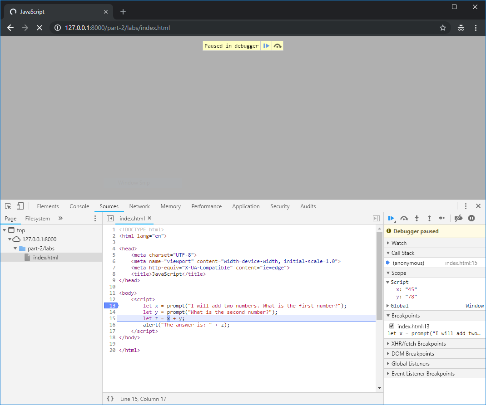

## Lab Exercise - Basic JavaScript & Debugging

We are now going to start to use JavaScript, and learn how to use the built-in tools in our browser to monitor how our code executes and debug problems.

!> You will need to use Google Chrome for the coding exercises in this week's lab sheet.

**One person** should take the lead with coding, and the other(s) act as reviewers and editors, helping the lead coder create the code: suggesting solutions for implementation, watching for typos and minor errors, and providing feedback and evaluation. You will also be using Git for version control for the code on this exercise, and will share it to GitLab so that your entire group has access to the final code.

!> This week, the member of the team doing the coding will be the person who's name comes last when team names are sorted alphabetically.

### Setting things up for this week

By now, you should already have added code from last week's lab exercise looking at responsive design into your group's project repository on GitLab.

We'll start by cloning our existing repository to the lab machine you will be working on, if you haven't already.

!> Only the person who is coding needs to do this

```bash
git clone git@gitlab.cs.cf.ac.uk:cmt112/<GROUPNAME>.git
```

We have the following layout for code in our project:

```
 index.html                     <- This is the base page for our project, it should link to each individual week
 readme.md
 .gitlab-ci.yml
|- week2-csslayout/             <- This is the folder for week 2
      - index.html
     |- css/
        - style.cssk
|- week3-responsive/            <- This is the folder for week 3
      - index.html
     |- css/
        - style.css
```

We'll need a new folder in our project for this week's work. Make a new folder (either in the file explorer or on the command line using the `mkdir` command), and call it 'week4-javascript'. Inside that folder, create an `index.html`. This is the base file for this week's project. Our layout will then look like:

```
 index.html                     <- This is the base page for our project, it should link to each individual week
 readme.md
 .gitlab-ci.yml
|- week2-csslayout/
      - index.html
     |- css/
        - style.css
|- week3-responsive/
      - index.html
     |- css/
        - style.css
|- week4-javascript/            <- This is the folder for this week's work
      - index.html
```

We can edit our root (the very bottom level/folder) `index.html` to link to our new project. Let's add a new link to this week's work:

```html
<!DOCTYPE html>
<html lang="en">
<head>
    <meta charset="UTF-8">
    <meta name="viewport" content="width=device-width, initial-scale=1.0">
    <meta http-equiv="X-UA-Compatible" content="ie=edge">
    <title></title>
</head>
<body>
    <h1>Our Work</h1>
    <ol>
        <li><a href="week2-csslayout">Week 2 - CSS Layout</a></li>
        <li><a href="week3-responsive">Week 3 - Responsive</a></li>
        <li><a href="week4-javascript">Week 4 - JavaScript</a></li>
    </ol>
</body>
</html>
```

Save the root `index.html`. Then, on the command line, do:

```bash
git add index.html
git add week4-javascript
git commit -m 'week 4'
git push
```

This will send your changes up to GitLab.

Periodically, when you reach a stage you are happy with while working on the lab activities, you should commit your code and `push` it to this repository. This will ensure that your whole group has access to the code after the lab exercise.

### JavaScript Debugging

Open your `index.html` for this week in a text editor, and at the same time, open it in Google Chrome.

!> You will also need the `Developer Tools` window open in Chrome

In the text editor, enter the following code for your index.html page:

```html
<!DOCTYPE html>
<html lang="en">

<head>
    <meta charset="UTF-8">
    <meta name="viewport" content="width=device-width, initial-scale=1.0">
    <title>JavaScript</title>
</head>

<body>
    <script>
        let x = prompt("I will add two numbers. What is the first number?");
        let y = prompt("What is the second number?");
        let z = x + y;
        alert("The answer is: " + z);
    </script>
</body>

</html>
```

Reload the page, and enter a number in the prompt box when requested. Pay attention to the answer in the alert box. Is it what you expected?

Lets use the debugger to see what's going on and try to figure out why we are getting the wrong answer. In the Developer Tools window in Google Chrome, click on the 'Sources' tab. in the left-hand pane you can see all the files that make up your webpage - in this case 'index.html'. This may already be selected, but if not select this file, and the source code will appear in the middle pane.


In order to see what is going on, we need to set a 'breakpoint'. A breakpoint allows us to pause our code at a particular point, or during a particular event. We can then have a look at the internal **state** of our program to see what is going on. This allows us to find and fix errors in our code. We'll set a breakpoint on the first line of code, line 13. Click on the '13' in the code shown in the Developer Tools, and it will be highlighted with a blue arrow:


We have now set a breakpoint - we have told our browser to pause our JavaScript code at this point so that we can examine it. Reload your page, and the browser will pause when it gets to this line of JavaScript:


We can now control how our browser executes our code, and **step through** the code line by line, or function by function. The debugger has a set of buttons that allow us to do this:


-  The first blue 'play' icon () allows us to resume our code. Our code will continue to run, until we hit another breakpoint or reach the end of the script.
-  The next three buttons (the curved arrow, the down arrow and the up arrow ) allow us to step over, in to and out of functions. We'll use these more as we start to look at functions in the coming weeks.
-  The last button, the arrow pointing to the right, is the control to step through our code one line at a time. This is the button we need to use right now.

Press the Step button once, and our first line of code will execute, and we'll see our prompt:


Enter the number 45 in the prompt, press OK, and we'll see the debugger updates our _state_ and moves on to the next line of code:


You can see that Line 14 of the code is now highlighted as the next line to be executed. The debugging pane on the right hand side of the window has also updated. In the 'Scope' section, you can see that we now have a local variable named `x` with a value of `"45"`. Press the step button again, and we'll run the next line of code. Again, a prompt will be shown. Enter 78 in this prompt, and click 'OK'. Our debugger state will be updated again:



Our 'Scope' section now has two local variables, `x` with a value of `"45"` and `y` with a value of `"78"`. Click the step button again. and our next line of code will be run, adding `x` and `y` together, and storing the result in the variable `z`:


The problem seems to be that our values are being stored as Strings. You can tell this by the fact that the values in the variables are wrapped in double quote (`"`) characters. When we try to add them together on line 15, rather than JavaScript performing numerical addition (and so adding 45 and 78 to get 123) it performs **string concatenation** and glues the two strings together, giving the result `"4578"`.

We can test that this really is the problem by using the 'Watch' section of the debugging pane. This allows us to monitor variable values, but we can also enter JavaScript expressions here. Click the `+` in the Watch section to add a new Watch expression, and type `typeof z`. The debugger will report that the type of `z` is `string`, just as we suspected:


We can fix this code easily, by telling JavaScript to treat the values returned from the prompt as numbers (or Integers) rather than Strings. Edit lines 13 and 14 of your code:

```html
let x = parseInt(prompt("I will add two numbers. What is the first number?"));
let y = parseInt(prompt("What is the second number?"));
```

The `parseInt` function takes a string as input and attempts to convert it to an integer. Reload your page and step through its operation again, and this time you will see that the variables are treated as numbers rather than strings, and that our page delivers us the answer we expect at the end:


### Coding in JavaScript

Now we can debug our JavaScript, let's have a go at solving some problems. There are two challenges for this lab session, you should be able to complete the first relatively easily given the exercise above. The second may take a little longer. 

!> Complete each task in a separate file and make sure the code is pushed to GitLab so everyone has access to it at the end of the session.

#### Multiplication
You should write a JavaScript program that asks the user for three numbers, (asking for a single number three separate times), multiplies the numbers together, and then returns the answer to the user, either via the console or an alert.

#### Guess the Number
You should write a JavaScript program that allows a player to enter a number between 0 and 100 that the computer will then guess. The player should respond whether the guess is the same as the number (Yes), Higher or Lower. The game should loop and continue guessing and asking if the number is correct, until it gets it right.

?> A template to be used as a starting point for this task can be found in the [cmt112-examples repository](https://gitlab.cs.cf.ac.uk/scm2mjc/cmt112-examples/blob/master/2-1/lab/guess.html).

Try to break your program by giving the computer the wrong answer, or a nonsensical answer. Can you add more code to the program to make sure it can cope with these types of inputs?

