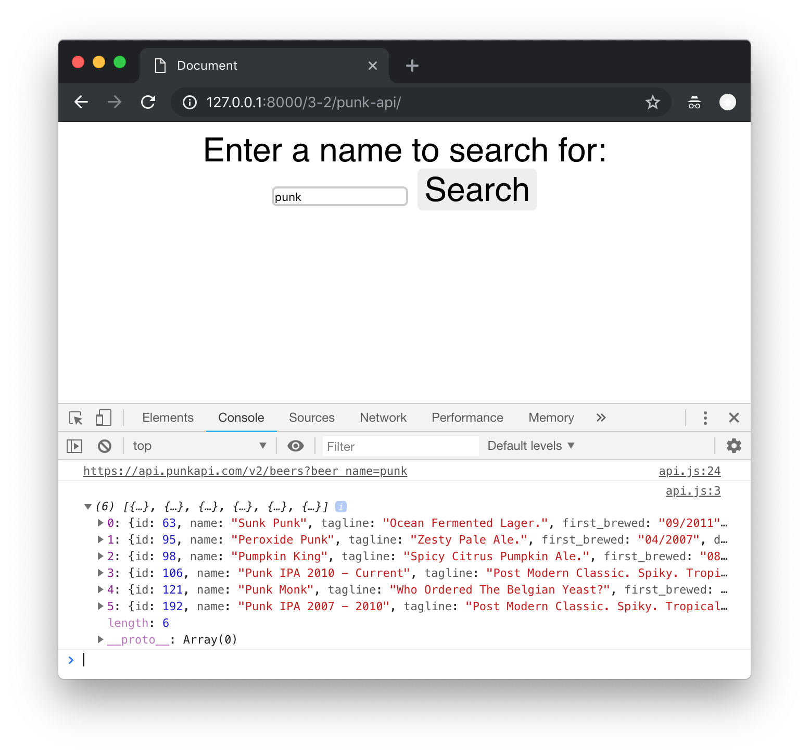
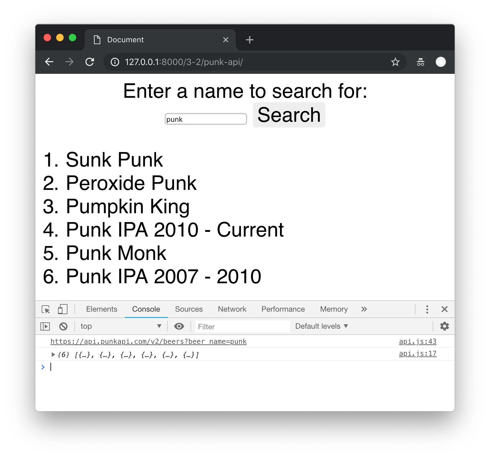

## Lab Exercise: APIs

!> Before we start - yet another survey for you to complete! The Welcome to Cardiff survey is for all new students to give us their feedback on the first few weeks of their degree programme. Before we start looking at putting an API request together, please take 5 minutes to complete this [survey](https://go.cf.ac.uk/welcomePGT18)


### Getting on with it

We are now going to practice using JavaScript to create a page that will take user input and make search requests on the API. The API we will be using is '[Punk API](https://punkapi.com/documentation/v2)' - an API to Brewdog's collection of beer recipes and data. The page we create will allow a user to search the API for particular beers, and will present the data back to the user.

**One person** should take the lead with coding, and the other(s) act as reviewers and editors, helping the lead coder create the code: suggesting solutions for implementation, watching for typos and minor errors, and providing feedback and evaluation. You will also be using Git for version control for the code on this exercise, and will share it to GitLab so that your entire group has access to the final code.

!> This week, the member of the team doing the coding will be the last person to stand up.

### Setting things up for this week

By now, you should already have added code from last week's lab exercise into your group's project repository on GitLab.

We'll start by cloning our existing repository to the lab machine you will be working on, if you haven't already.

!> Only the person who is coding needs to do this

```bash
git clone git@gitlab.cs.cf.ac.uk:cmt112/<GROUPNAME>.git
```

We'll need a new folder in our project for this week's work. Make a new folder (either in the file explorer or on the command line using the `mkdir` command), and call it 'week8-apis'.

### Basic Page

Lets set up a basic page with a text input box and an action button, and give it some CSS styling:

```html
<!DOCTYPE html>
<html lang="en">
    <head>
        <meta charset="UTF-8" />
        <meta name="viewport" content="width=device-width, initial-scale=1.0" />
        <meta http-equiv="X-UA-Compatible" content="ie=edge" />
        <link rel="stylesheet" href="css/style.css" />
        <title>Document</title>
    </head>

    <body>
        <div id="input">
            <form>
                <label for="search_term"
                    >Enter a name to search for: <input type="text" id="search_term" />
                </label>
                <input type="button" id="search_button" value="Search" />
            </form>
        </div>
        <div id="output"></div>
        <script src="js/api.js"></script>
    </body>
</html>
```

```css
body {
    font-family: "Montserrat", "Helvetica Nueue", Helvetica, Arial, sans-serif;
    font-size: 2em;
}

#input {
    width: 70%;
    text-align: center;
    margin: auto;
}

input[type="text"] {
    border: 2px solid #ccc;
    border-radius: 5px;
}

input[type="text"]:focus {
    border-color: #333;
}

input[type="button"] {
    background-color: #eee;
    border: 0 none;
    cursor: pointer;
    border-radius: 5px;
    font-family: "Montserrat", "Helvetica Nueue", Helvetica, Arial, sans-serif;
    font-size: 1em;
}
```

Now we can start our `api.js` file. To begin with, lets make sure we can respond to the user entering some text into the text box and clicking on the 'Search' button.

```js
let submitButton = document.getElementById("search_button");
submitButton.addEventListener('click', function () {

    let search_term = document.getElementById("search_term").value;
    console.log(search_term);
}
```

Here we are acquiring a reference to the 'Search' button using `getElementById` and then adding an event listener to the button to respond to `click` events. Inside the function that runs when a `click` event happens we then obtain a reference to the `search_term` text box, get the value in the text box, and store it in a variable for later.

Lets add a function that will take some parameters for an API call, and convert them into a String:

```js
const encodeParameters = function(params) {
    var strArray = [];
    Object.keys(params).forEach(function(key) {
        var paramString = encodeURIComponent(key) + "=" + encodeURIComponent(params[key]);
        strArray.push(paramString);
    });
    return strArray.join("&");
};
```

This function will take an object of parameters like this:

```js
let parameters = {
    name: "martin",
    job: "paper work"
};
```

and turn it into a String like this:

```js
paramString = "name=martin&job=paper%20work";
```

This means we can store our parameters for API calls in a nice JavaScript data structure (an Object) then turn them into an appropriate String when the time comes.

Now, let's make an API request:

```js
const makeAPIQuery = function(search_term) {
    let rootURL = "https://api.punkapi.com/v2/beers";

    let params = {
        beer_name: search_term
    };

    let queryURL = rootURL + "?" + encodeParameters(params);
    console.log(queryURL);

    let xhttp = new XMLHttpRequest();
    xhttp.addEventListener("load", processResponse);
    xhttp.open("GET", queryURL);
    xhttp.send();
};
```

Here we use our encodeParameters function to put together a full query URL we can call to get the data we want. We then create an `XMLHttpRequest` object and tell it to call this URL. Once the API call has finished, a `load` event will fire and call the `processResponse` function.

Of course, we haven't written the `processResponse` function, so lets do that next:

```js
const processResponse = function() {
    let response = JSON.parse(this.response);
    console.log(response);
};
```

All we need to do now is call the `makeAPIQuery` function when the user clicks the `Search` button. Putting all of this together, we end up with a basic working example:

```js
const processResponse = function() {
    let response = JSON.parse(this.response);
    console.log(response);
};

const encodeParameters = function(params) {
    var strArray = [];
    Object.keys(params).forEach(function(key) {
        var paramString = encodeURIComponent(key) + "=" + encodeURIComponent(params[key]);
        strArray.push(paramString);
    });
    return strArray.join("&");
};

const makeAPIQuery = function(search_term) {
    let rootURL = "https://api.punkapi.com/v2/beers";

    let params = {
        beer_name: search_term
    };

    let queryURL = rootURL + "?" + encodeParameters(params);
    console.log(queryURL);

    let xhttp = new XMLHttpRequest();
    xhttp.addEventListener("load", processResponse);
    xhttp.open("GET", queryURL);
    xhttp.send();
};

let submitButton = document.getElementById("search_button");
submitButton.addEventListener("click", function() {
    let search_term = document.getElementById("search_term").value;

    if (search_term) {
        makeAPIQuery(search_term);
    }
});
```

If you load the page and make a query, you can see the response in the console:



Once this is working, we can use similar code to that we were looking at in the To-Do List example to add some details of the beer to a list:

```js
const createList = function(parentElement) {
    let newList = document.createElement("ol");
    parentElement.appendChild(newList);
    return newList;
};

const addListItem = function(parentList, textContent) {
    let newItem = document.createElement("li");
    newItem.appendChild(document.createTextNode(textContent));
    parentList.appendChild(newItem);
};

const processResponse = function() {
    let response = JSON.parse(this.response);
    console.log(response);
    let outputDiv = document.getElementById("output");
    let newList = createList(outputDiv);
    response.forEach(function(beer) {
        addListItem(newList, beer.name);
    });
};
```

Our full example will now allow us to search for a beer, and will add the results to a list:



### Doing something else

Now we have a basic example working, can you make it do something more interesting?

?> Can you add more details on the beers returned from the API? Perhaps a list is not the best way to display a lot of information - could you use a more sophisticated presentation?

?> Can you change the functionality of the website - rather than searching by beer name, can you search for food pairings instead? You'll need to check the [API documentation](https://punkapi.com/documentation/v2) for the different parameters accepted by the API.

?> How about combining functionality? Can you have multiple search terms (for instance, search for beers above a certain ABV that go well with fish?)
