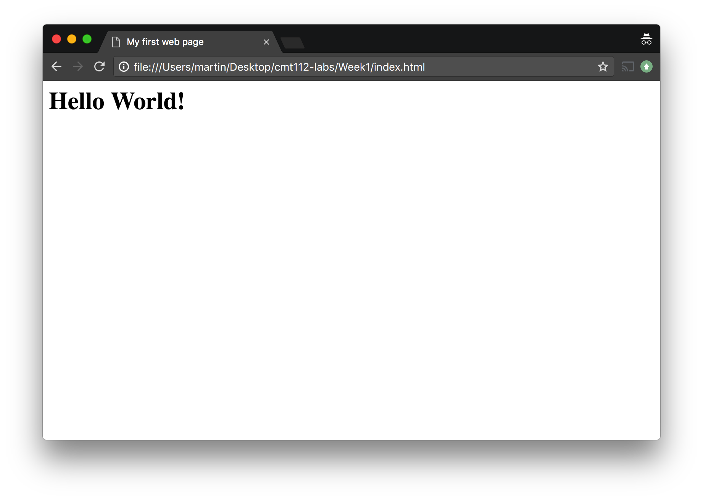
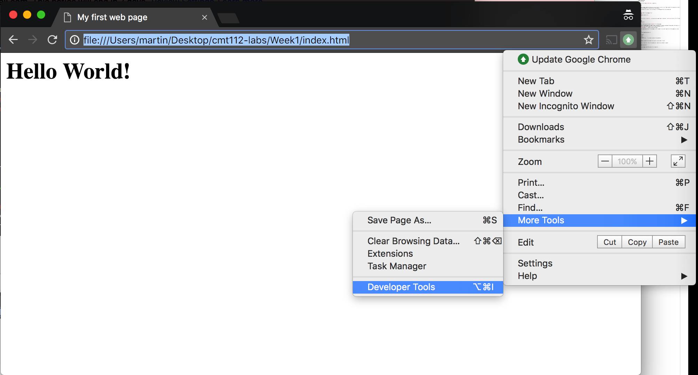
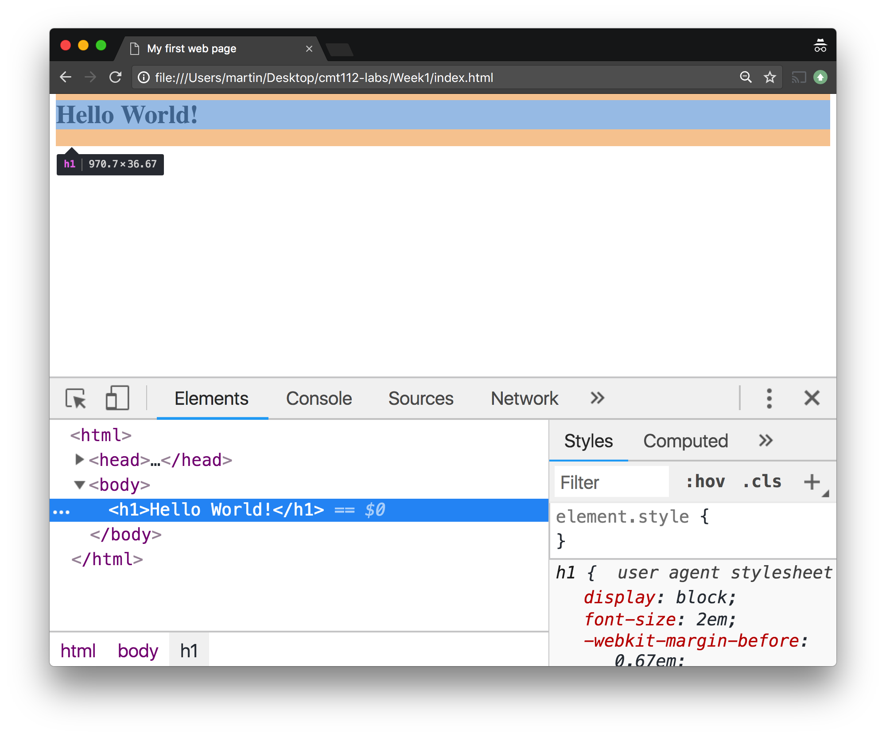
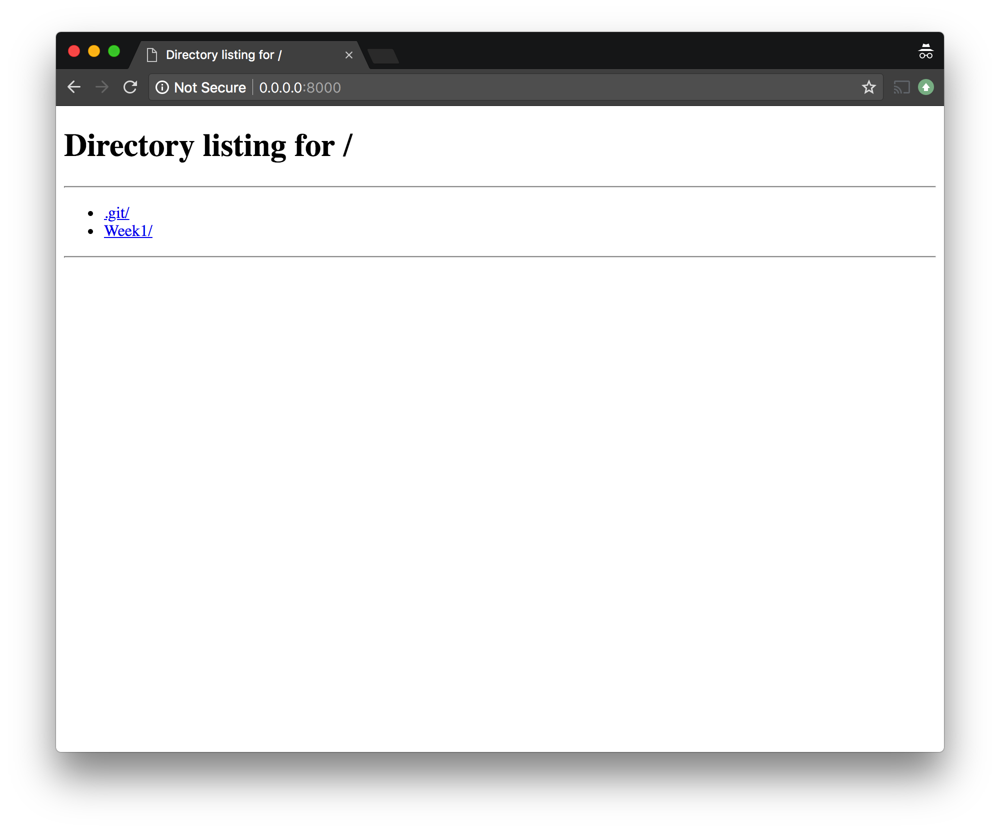
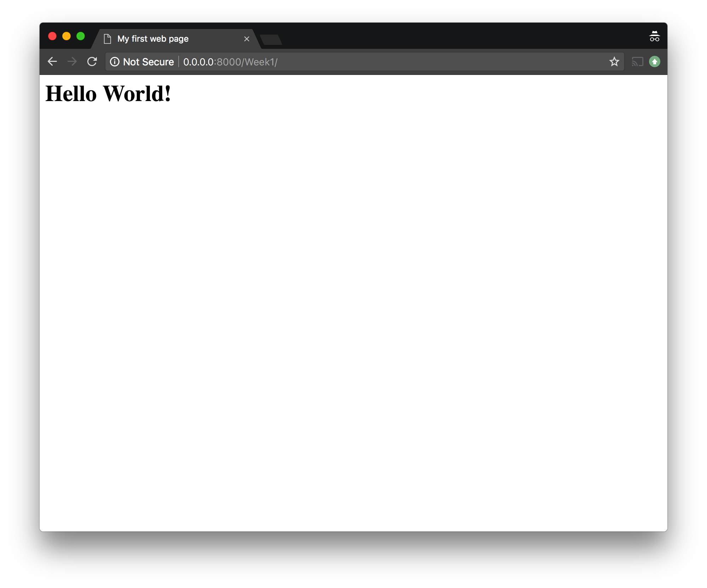
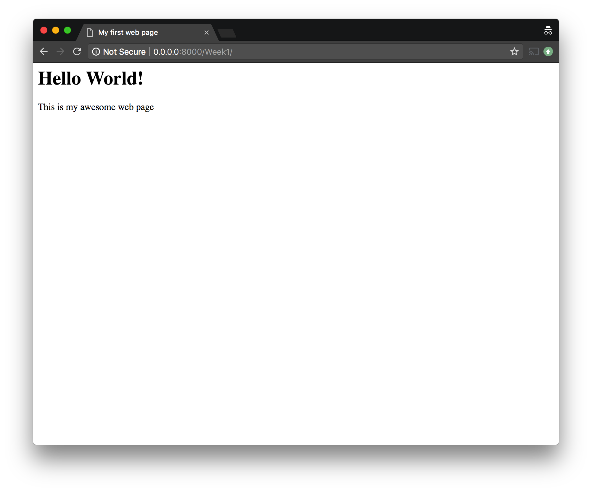
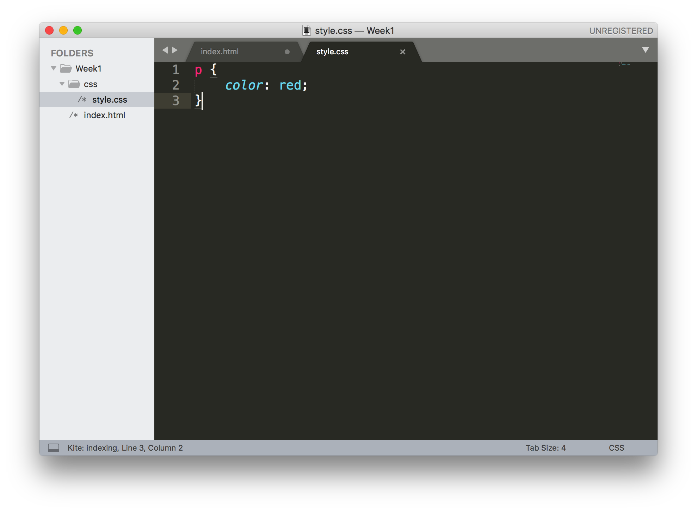
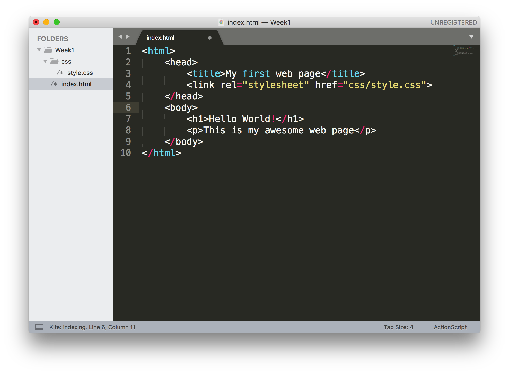

## Lab Exercise - Creating a Web Page

During the lab activity for this topic we will put what we have learnt into practice by creating a simple HTML web page. We will also practice using version control software to ensure our code is safely versioned and stored. 

!> This lab assumes that you completed the '[Introduction to Git](http://comsc.pages.cs.cf.ac.uk/introduction-to-git/#/)' exercise during induction week. If you have not already completed this exercise, please [go and work through that exercise](http://comsc.pages.cs.cf.ac.uk/introduction-to-git/#/) first, before coming back to complete this activity.

For this exercise we'll need a few different applications open. You should search for and open all these applications before we start:

1. Sublime Text - the default text editor on the Windows PCs in COMSC
2. Git Bash - a command line terminal that we'll use both for version control and running a simple web server
3. Google Chrome - a web browser for viewing the web page we create

Our first step is not to start writing HTML code, but rather to intialise an empty Git repository to use to version our work.  Let's create a directory on our H: drive for our work and then move into that directory:

```bash
$ cd /h
$ mkdir cmt112-labs
$ cd cmt112-labs
```

Then we tell Git to make `cmt112-labs` a repository:

```bash
$ git init
```

We now have an empty repository that we can store our work in. Later on, we'll add a remote to the repository so that our work is also backed up on the School GitLab server. For now though, we'll just work on our local machine.

Switch to Sublime Text, and we'll start writing our first HTML page. Enter the following code:

```html
<html>
    <head>
        <title>My first web page</title>
    </head>
    <body>
        <h1>Hello World!</h1>
    </body>
</html>
```

Now save this file as `index.html`, in a new directory named `Week1` inside your `cmt112-labs` directory. Your file and directory structure should look like this:

```
cmt112-labs
  |- Week1
     |- index.html
```

?> Question: Why do we use the name `index.html` for the web page?

We can view our new HTML page in a number of ways. The easiest is to open a new Google Chrome window, then drag the `index.html` file from a File Explorer window and drop it onto our web browser window. This will open and display the file:

.

### Committing our changes

We're pretty impressed with our first web page, so let's commit it to our git repository. On the command line, type:

```bash
git status
```
You should see something similar to:

```output
On branch master

Initial commit

Untracked files:
  (use "git add <file>..." to include in what will be committed)

	Week1/

nothing added to commit but untracked files present (use "git add" to track)
```

We'll add our `index.html` file to the staging area, ready to be included in a commit:

```bash
git add Week1/index.html 
```

and now, we can again check the status of our repository:

```bash
git status
```

```output
On branch master

Initial commit

Changes to be committed:
  (use "git rm --cached <file>..." to unstage)

	new file:   Week1/index.html
```

Let's make a commit and store a permanent record of this code:

```bash
git commit -m "hello world web page"
```

```output
[master (root-commit) 8af492c] hello world web page
 1 file changed, 8 insertions(+)
 create mode 100644 Week1/index.html
```

!> This is the same process we'll use whenever we want to save a copy of our work - first `git add` the code to our staging area, then `git commit` the code to our repository. You should do this from now on whenever you have made a significant change to your work (there will be reminders to do this occasionally!).

### Developer Tools

An important part of being a web developer is being able to understand how the browser views and processes your page. To help us do this, the browser contains a set of tools that we can use to examine our page and how it is loaded and displayed by the browser. To open the developer tools in Chrome, use the menu, and select ‘More tools’ and then ‘Developer tools’:



The developer window will open within your browser. The different tabs allow you to examine different aspects of the web browser and your page. The ‘Elements’ tab shows you the source code of your web page, as well as the CSS styles that have been applied to the elements of the page. Hovering over an element in the ‘Elements’ tab will highlight the element in the page above, and tell you its size. The right hand side of the developer window will show you the element’s CSS styles, and give a graphic representation of the element’s size in terms of margin, border and padding:



We can edit the content of our webpage (temporarily) from within the developer tools. Double click on the `h1` element, and we can change the text content. If you refresh the page, the original file will be loaded from disk, and your changes will be gone.

### Running a local web server

Opening files by dropping them into our web browser window is all well and good, but usually our HTML files we be served to our web browser by a web server. This is a special piece of software which runs on a machine waiting for requests from web browsers. When it receives a request for a specific file or resource, it attempts to respond to the web browser with the item requested.

When we are developing a web page we can run a simple local web server that will carry out this request - response process and mimic our web page running on a web server somewhere on the Internet.

If you don't already have one open, open a command line and navigate to the folder where our lab code is stored:

```bash
cd cmt112-labs
```

We can use a built-in feature of the Python programming language to run a simple web server:

```bash
python -m http.server
```

This will start a web server in the current directory, which will sit and wait for requests from a web browser:

```output
Serving HTTP on 0.0.0.0 port 8000 (http://0.0.0.0:8000/) ...
```

If we enter the local IP address for the machine (`http://127.0.0.1:8000`) in the address bar of the browser, we will see the directory listing for our web server:



You can see two directories: our `Week1` directory where our webpage is saved, and the special `.git` folder created by Git, where the data for our Git repository is stored. If we click on the `Week1` directory, we will see our `index.html` page:



?> Now you can see why we named our HTML page `index.html` - a web server will automatically serve a page named `index.html` when a request is made for a given directory. By using this name, the index page will automatically be loaded rather than the server displaying a directory listing as it did for the parent directory.

If we look at the command line, we can see the output from our web server, listing the requests made to the web server:

```output
Serving HTTP on 0.0.0.0 port 8000 (http://0.0.0.0:8000/) ...
127.0.0.1 - - [17/Sep/2018 21:01:15] "GET / HTTP/1.1" 200 -
127.0.0.1 - - [17/Sep/2018 21:01:15] "GET /favicon.ico HTTP/1.1" 404 -
127.0.0.1 - - [17/Sep/2018 21:03:20] "GET /Week1/ HTTP/1.1" 200 -
```

The first request was for '/', the root directory where the server is running. We can see the code `200` here, indicating this request was successful. (We'll look at response codes in more depth later). This was followed by a request for `/favicon.ico`. This is the browser requesting an icon to display representing the web page. We haven't provided one, so this request has a `404` response - which means the requested resource has not been found. The final request is asking for the `Week1` directory, which succeeds as the browser is able to respond with the `index.html` page.

?> From now on, we'll use a local web browser to serve our web pages while we're developing them. Remember to use `python -m http.server` to start a web server in your root directory whenever you start working on your code.

### Experimenting with HTML

This is all you need to start developing web pages, so let's add some more content to our page. We'll start by adding a bit of text:

```html
<html>
    <head>
        <title>My first web page</title>
    </head>
    <body>
        <h1>Hello World!</h1>
        <p>This is my awesome web page</p>
    </body>
</html>
```

Which means our page will now look like:



We like the change we've made to the page, so let's commit these changes:

```bash
git add Week1/index.html
git commit -m "added a paragraph"
```

?> How would we revert these changes using Git if we then decided we didn't like the content addition?


### Adding CSS

Once we've got some HTML content, we can start to style it using CSS.

We can add CSS to our HTML files by including it in a separate file. Create a new file in your text editor, and write a CSS rule that will apply to all paragraph elements:



Before we can link the CSS to our HTML, we need to save the file. Here I have saved it as `style.css` in a subfolder named `css` within the same directory as
the `index.html` file. 

```
cmt112-labs/
  |- Week1/
    |- index.html
      |- css/
        |- style.css
```

We can then link this CSS to our HTML file using a link element in the head of our HTML:



If we refresh the page in our browser, we'll see the CSS rules applied to our paragraph elements:


### Going Further

Now it is your turn to start writing HTML. Experiment with adding more content, using some of the HTML tags we have already seen in this week's reading and videos. Try and add the following types of content to your page:

* a link to another webpage
* an image
* a bulleted list
* a range of headings
* several paragraphs of text
* a link from one part of your page to another

Use CSS rules to change the formatting of your content.

?> Remember to commit your changes frequently, and definitely commit your final code at the end of the lab!