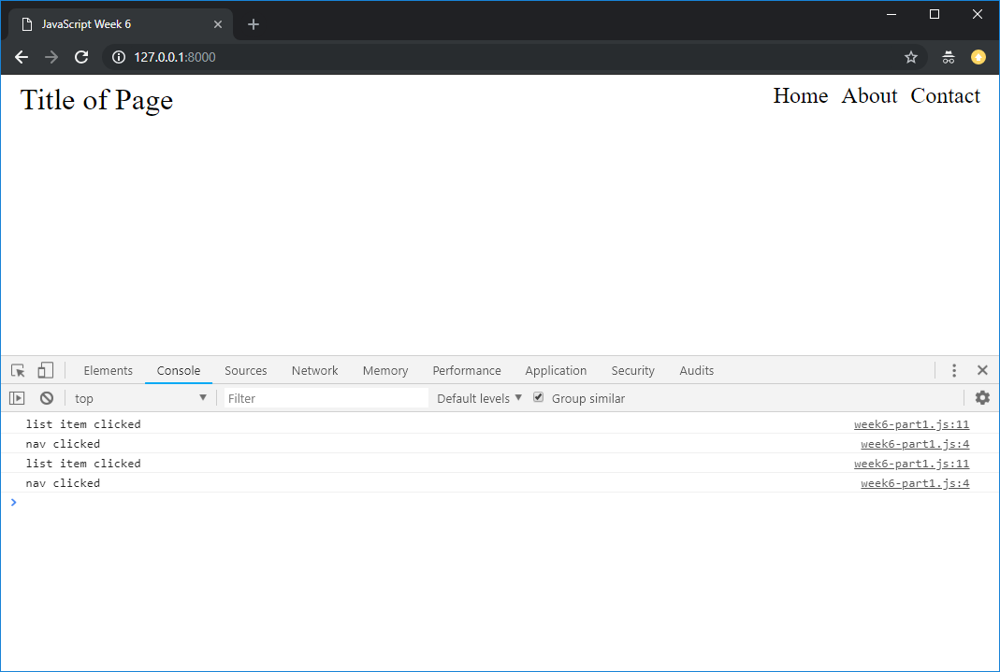

## Lab Exercise - Forms & JavaScript Events

We are now going to start to look at dynamically updating our pages using JavaScript, reacting to JavaScript events, and capturing information from the User using Form elements

!> You will need to use Google Chrome for the coding exercises in this week's lab sheet.

**One person** should take the lead with coding, and the other(s) act as reviewers and editors, helping the lead coder create the code: suggesting solutions for implementation, watching for typos and minor errors, and providing feedback and evaluation. You will also be using Git for version control for the code on this exercise, and will share it to GitLab so that your entire group has access to the final code.

!> This week, the member of the team doing the coding will be the person sat furthest to the right of the group

### Setting things up for this week

By now, you should already have added code from last week's lab exercise solving a set of JavaScript problems into your group's project repository on GitLab.

We'll start by cloning our existing repository to the lab machine you will be working on, if you haven't already.

!> Only the person who is coding needs to do this

```bash
git clone git@gitlab.cs.cf.ac.uk:cmt112/<GROUPNAME>.git
```

We have the following layout for code in our project:

We'll need a new folder in our project for this week's work. Make a new folder (either in the file explorer or on the command line using the `mkdir` command), and call it 'week6-javascript'. Inside that folder, create an `index.html`. This is the base file for this week's project.

```html
<!DOCTYPE html>
<html lang="en">

<head>
    <meta charset="UTF-8">
    <meta name="viewport" content="width=device-width, initial-scale=1.0">
    <title>JavaScript</title>
</head>

<body>
    <script src="week6-part1.js">
    </script>
</body>

</html>
```

You should also create a JavaScript file in the same directory named `week6-part1.js`. This file will contain the JavaScript code we are working on (to begin with), and as you can see, we have already linked to this file in `index.html`. The contents of `week6-part1.js` should be:

```js
console.log("it works!");
```

Open the page in a web browser and check the developer tools, and hopefully you should see the output in the console:


### JavaScript Events

Lets add some content to our page, and some styling. First, the body content:

```html
<body>
    <header>
        <h1>Title of Page</h1>
        <nav>
            <ul>
                <li>Home</li>
                <li>About</li>
                <li>Contact</li>
            </ul>
        </nav>
    </header>


    <script src="week6-part1.js"></script>
</body>
```

Now lets style the page. First we'll apply a CSS reset by including a link to one in our `<head>` element:

```html
<head>
    <meta charset="UTF-8">
    <meta name="viewport" content="width=device-width, initial-scale=1.0">
    <meta http-equiv="X-UA-Compatible" content="ie=edge">
    <title>JavaScript Week 6</title>
    <link rel="stylesheet" href="https://unpkg.com/reset-css@4.0.1/reset.css">
</head>
```

Now let's also add our own CSS file:

```html
<head>
    <meta charset="UTF-8">
    <meta name="viewport" content="width=device-width, initial-scale=1.0">
    <meta http-equiv="X-UA-Compatible" content="ie=edge">
    <title>JavaScript Week 6</title>
    <link rel="stylesheet" href="https://unpkg.com/reset-css@4.0.1/reset.css">
    <link rel="stylesheet" href="style.css">
</head>
```

Lets create the file `style.css` and add some contents:

```css
h1 {
  font-size: 2em;
}

header {
  display: flex;
}

header h1 {
  padding-left: 20px;
  padding-top: 10px;
  width: 60vw;
}

nav {
  padding-right: 20px;
  padding-top: 10px;
  width: 40vw;
  text-align: right;
}

nav > ul > li {
  padding-left: 10px;
  font-size: 1.5em;
  display: inline-block;
}
```

That was quite a lot of code to get a basic layout so we can start to experiment with JavaScript events. It should create a page that looks a little something like this:


Lets add some event listeners to our page. We'll start by listening to events on the `nav` element. In `week6-part1.js`:

```js
let nav_element = document.getElementsByTagName("nav")[0];

nav_element.addEventListener("click", function() {
  console.log("nav clicked");
});
```

> ? Refresh the page and try clicking on your nav element - you should see output in the console.

Now let's add another listener to each of the list items in the `<ul>` inside the nav:

```js
let list_items = document.getElementsByTagName("li");

for (var i = 0; i < list_items.length; i++) {
  list_items[i].addEventListener("click", function() {
    console.log("list item clicked");
  });
}
```

Now when you click on an item in the nav bar you should see two pieces of output - one when the click event is registered by the `li` and one when it is registered by the `nav`.



You can see from the order of the output in the console that the `li` element gets to deal with the event first, then the `nav` element.

?> How would we change the code so that the `nav` element is able to deal with the event first? Try it out.

If we want a parent element (or grand parent, or any kind of ancestor) to deal with events before the children of that element, we need to register the event listener with the `usecapture` parameter set to `true`. Events on that element will then be dealt with in the capture phase, rather than the bubbling phase, so before they reach the children of the element.

?> Can you modify the code so that it prints the number of the list item that has been clicked? Does it work as you expect?

