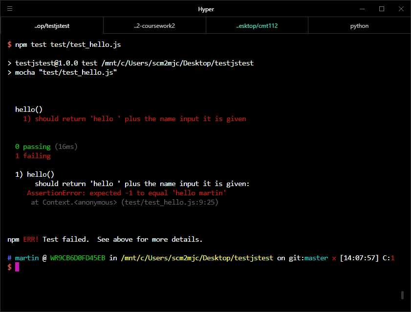
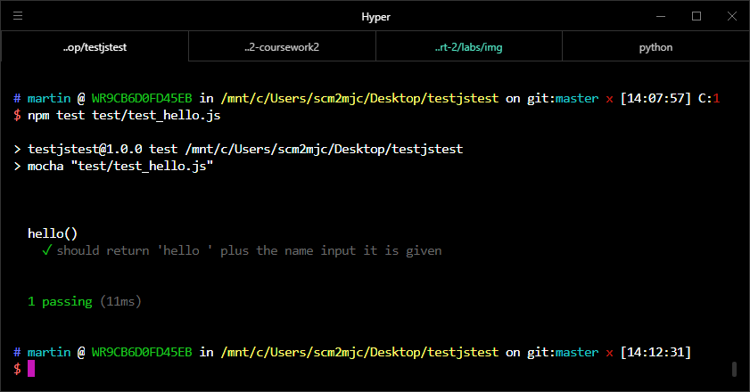

## Lab Exercise - JavaScript Problems

We are now going to practice using JavaScript to solve simple problems, to check we understand some of the fundamentals of the language before we start getting into more complicated code. We are also going to get some experience of using testing frameworks to check our code is correct.

**One person** should take the lead with coding, and the other(s) act as reviewers and editors, helping the lead coder create the code: suggesting solutions for implementation, watching for typos and minor errors, and providing feedback and evaluation. You will also be using Git for version control for the code on this exercise, and will share it to GitLab so that your entire group has access to the final code.

!> This week, the member of the team doing the coding will be the person who is sat furthest to the left in your group.

### Setting things up for this week

By now, you should already have added code from last week's lab exercise into your group's project repository on GitLab.

We'll start by cloning our existing repository to the lab machine you will be working on, if you haven't already.

!> Only the person who is coding needs to do this

```bash
git clone git@gitlab.cs.cf.ac.uk:cmt112/<GROUPNAME>.git
```

We'll need a new folder in our project for this week's work. Make a new folder (either in the file explorer or on the command line using the `mkdir` command), and call it 'week5-javascript'.

We have a set of code templates to work from this week. Download [the starting source code for this week](https://gitlab.cs.cf.ac.uk/cmt112/week5-javascript-programming/-/archive/master/week5-javascript-programming-master.zip) and extract it into the week5-javascript folder.

There are a lot of files in this folder.

- There are a number of `.js` files. Each one contains a single JavaScript function that we need to complete.
- There is a folder called `test`. This contains test cases that check that the JavaScript functions we are going to write are working correctly.
- There is a `.gitignore` file. This tells Git to ignore certain files and folders and not to inlcude them in the repository.
- There is a `package.json` and a `package-lock.json`. These are used for managing the installation of JavaScript modules when we are using JavaScript on the command line. We'll look at these in more detail in a couple of weeks time.

Open a command line, and navigate to the directory with all the files you just downloaded. The first thing we need to do is install some requirements for todays lab. We can do this using the command `npm install`. This will download a few JavaScript packages into a folder called `node_modules`. You don't need to worry about this too much at the moment, again, we'll look at this more in a couple of weeks time.

As mentioned - the code we have downloaded comes with a set of test cases that check whether the code is working. We can run these tests with the command `npm test`. If you run this command, you should see the output from all the tests included in the test directory. There will be a lot of errors, because at this point all but one of our tests are failing.

It's difficult to see what's going on when we run all the tests at the same time, so let's run an individual test instead:

```bash
npm test test/test_hello.js
```

!> If you are using the Git Bash command line this command should work fine. If you are using the windows command line you should use `npm test test\test_hello.js`.

You should get some output something like the below:



This command has run the test case in the file `test_hello.js`, which checks the function in `hello.js` to make sure it works correctly. The test is failing, so clearly there is something wrong with our function. Open up the file `hello.js`

```js
function hello(name) {
  // should return "hello name"
  return -1;
}

module.exports = hello;
```

We can see that the function `hello` just returns -1, when it should use the name it is given and return a String. Let's fix the function:

```js
function hello(name) {
  // should return "hello name"
  return "hello " + name;
}

module.exports = hello;
```

If we save the file, and then run the test again:

```bash
npm test test/test_hello.js
```

We should see that we have fixed the code and the test case now passes:



Your task for this week is to go through the JavaScript functions fixing them so that they all pass their test cases. At the end of the session you should be able to run `npm test` and get no error messages about failing tests.

### The problems

1.) Hello

- file: `hello.js`
- test: `test/test_hello.js`

This function accepts a String as input and should return that String with `hello` prepended to it.

2.) Sumall

- file: `sumall.js`
- test: `test/test_sumall.js`

This function accepts a number as input. It then returns the sum of all numbers _lower than or equal to_ this value. For example, if given the input `5`, it should return `15` - (`5 + 4 + 3 + 2 + 1`)

3.) Sumall35

- file: `sumall35.js`
- test: `test/test_sumall35.js`

This function accepts a number as input. It then returns the sum of all numbers _lower than_ this value that are exactly divisible by 3 or 5. For example, if given the input `7`, it should return `14` - (`6 + 5 + 3`)

4.) Largest

- file: `largest.js`
- test: `test/test_largest.js`

This accepts an Array as input and should return the largest value in the Array. For example, if given the input `[4, 3, 2]` it should return `4`

5.) HighestLowest

- file: `highestlowest.js`
- test: `test/test_highestlowest.js`

This function accepts a String as input. This String will be a set of space separated numbers. The function should return the highest and lowest numbers in the String, as another space separated String, with the highest number first. For example, given the input `"4 6 8"` it should return `"8 4"`

6.) Even Or Odd

- file: `evenorodd.js`
- test: `test/test_even_or_odd.js`

This function takes a number as input and returns "even" if the number is even (exactly divisible by 2) or "odd" if the number is odd.

7.) MakeNegative

- file: `makenegative.js`
- test: `test/test_makenegative.js`

This function takes a number as input. If the number is positive, it returns a negative number with the same magnitude. If the number is negative, it returns the number. So, for example, given the input `5` it should return `-5`

8.) Middle

- file: `middle.js`
- test: `test/test_middle.js`

This function takes a String as input. If the length of the String is odd, it returns the middle character of the String. If the length of the String is even, it returns the middle two characters.

9.) Mumbling

- file: `mumbling.js`
- test: `test/test_mumbling.js`

This function accepts a String as input and returns a new String made up of the characters of the original string repeated `n` times, where `n` is their position in the original String. The set of repeated characters should be in TitleCase. For example, given the input `her` it should return `H-Ee-Rrr`

10.) Palindrome

- file: `palindrome.js`
- test: `test/test_palindrome.js`

This function returns `true` if the supplied input String is a palindrome, `false` if not. A palindrome is a word that is spelt the same backwards and forwards.

11.) Repeat String

- file: `repeatstring.js`
- test: `test/test_repeatstring.js`

This function accepts a String `s` as input and a number `n` and returns the String `s` repeated `n` times. For example, if given the input `hi` and 6, it would return `hihihihihihi`

12.) Smush

- file: `smush.js`
- test: `test/test_smush.js`

This function accepts two Arrays as inputs, and returns a new array formed by stitching the two Arrays together an element at a time. For example, given the input `[5, d]` and `[f, 6]` it should return `[5, f, d, 6]`

13.) Population

- file: `population.js`
- test: `test/test_population.js`

This function models population growth to see how long it will take a town of a certain size to reach a target population. It has a number of parameters:

- the starting population
- the natural percentage increase each year
- the number of people who move to the town each year
- the target population

The function will use the first three parameters to calculate and return the number of years before the population hits the supplied target.

### Finished?

If you solve all these problems, go back to the 'Guess the Number' game from last week and make sure you have finished that. Can you refactor\* the code in any way now that you are able to write functions and use Objects?

\*refactoring is re-writing and simplifying

Could you write some test cases for parts of your 'Guess the Number' game?
