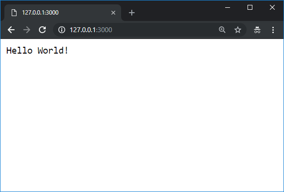
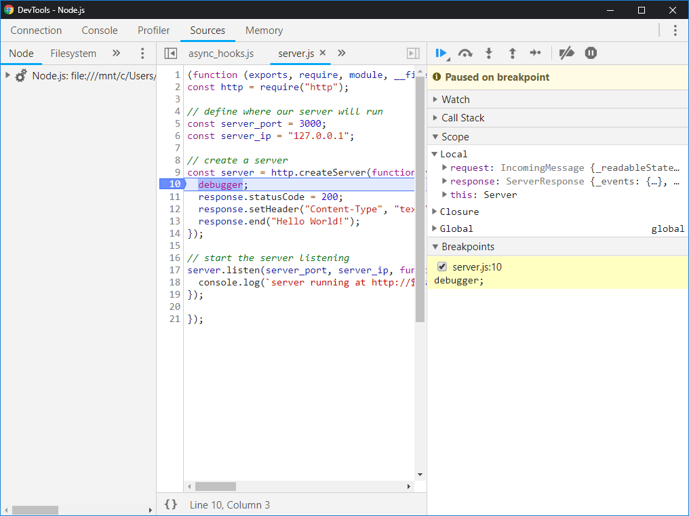
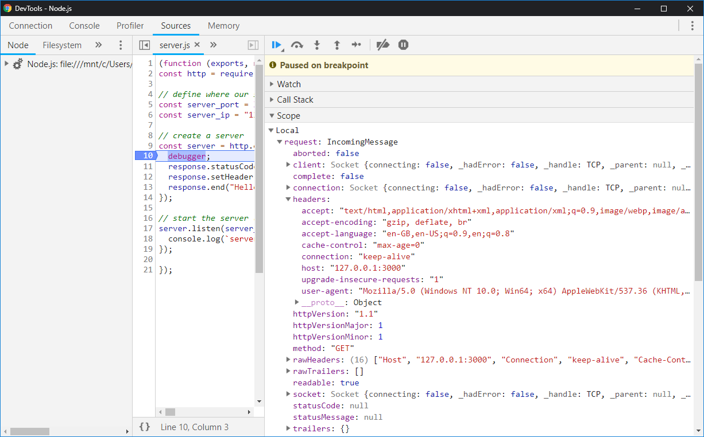
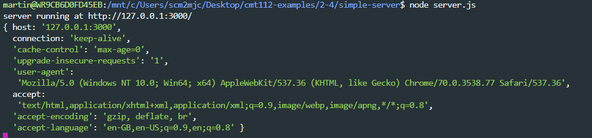
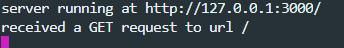
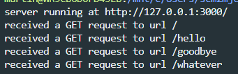
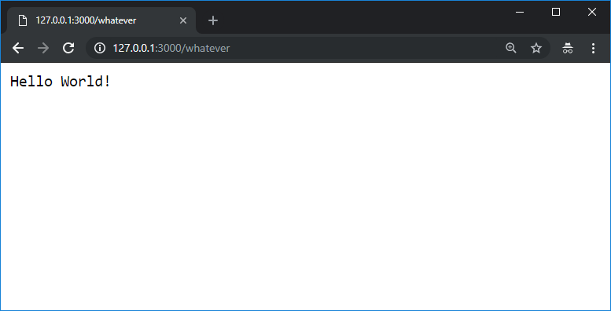
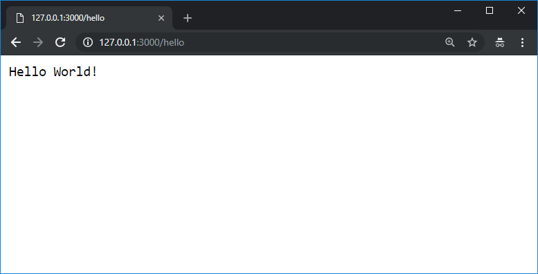
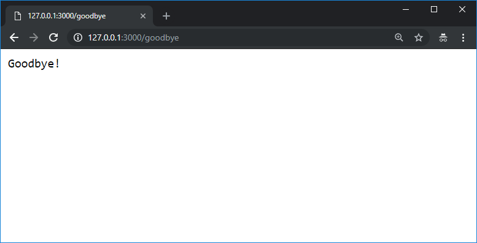
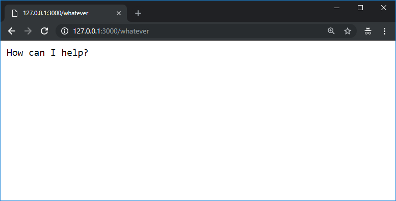

## Lab Exercise: Server Side JavaScript

We are now going to start having a look at using JavaScript on the server using [NodeJS](https://nodejs.org/en/). [Node](https://nodejs.org/en/about/) is basically a JavaScript engine (the [V8 engine](https://en.wikipedia.org/wiki/Chrome_V8)), but instead of running inside a web browser, it runs on the command line, and includes a lot of handy JavaScript modules for doing certain tasks (like reading and writing files, or running servers).

!> Node should already be installed on your lab machine. If you get an error message when trying to run node stating `command not found` try another lab machine.

**One person** should take the lead with coding, and the other(s) act as reviewers and editors, helping the lead coder create the code: suggesting solutions for implementation, watching for typos and minor errors, and providing feedback and evaluation. You will also be using Git for version control for the code on this exercise, and will share it to GitLab so that your entire group has access to the final code.

!> This week, the member of the team doing the coding will be the last person to read this sentence and say the word 'ostrich'.

### Setting things up for this week

By now, you should already have added code from last week's lab exercise into your group's project repository on GitLab.

We'll start by cloning our existing repository to the lab machine you will be working on, if you haven't already.

!> Only the person who is coding needs to do this

```bash
git clone git@gitlab.cs.cf.ac.uk:cmt112/<GROUPNAME>.git
```

We'll need a new folder in our project for this week's work. Make a new folder (either in the file explorer or on the command line using the `mkdir` command), and call it 'week7-server-side-js'.

### A simple Web Server

Inside the directory for this week, run the following command:

```bash
npm init
```

This will ask you a number of questions to create a basic `package.json` file. You can accept the default answers for all the questions _except_ the question which asks you what the 'entry point' of the program will be. Here you should type the answer `server.js` - we are telling NPM that our program will be stored in a file called `server.js`, not `index.js` as it is expecting:


This will create a `package.json` file which is a simple text file that contains metadata about our code. It is also used to install _dependencies_, but we'll worry about that later.

Now we have the `package.json` we can create our `server.js` file. Open a text editor, and enter the following code:

```js
// http module gives us simple server functionality
const http = require("http");

// define where our server will run
const server_port = 3000;
const server_ip = "127.0.0.1";

// create a server
const server = http.createServer(function(request, response) {
  response.statusCode = 200;
  response.setHeader("Content-Type", "text/plain");
  response.end("Hello World!");
});

// start the server listening
server.listen(server_port, server_ip, function() {
  console.log(`server running at http://${server_ip}:${server_port}/`);
});
```

This is all we need to create a basic web server in Node. On the command line, type:

```bash
node server.js
```

and you should see the output:

```
> node server.js
server running at http://127.0.0.1:3000/
```

Open a new web browser tab, and enter the address `http://127.0.0.1:3000/` and you will see the response from the server:



### Debugging

JavaScript running in Node is very similar to JavaScript running in the browser. We even have access to a `console` object, just like in the browser, and we've already used it to log some information, just like we do in the browser, except here, as we've seen, it gets printed to the command line where the server is running, instead of the console inside the browser.

"HANG ON!" I hear you cry. "You said that printing variables to the console to debug code was too simple, and that we should use the debugger instead! Now we're stuck on the command line, what gives?" Well, yes, you are right. And in fact - there is a way to debug our code using a proper debugger.

If we run our code using:

```bash
node --inspect-brk server.js
```

it will start in a debug mode, and pause once our code starts running. If you then open a Chrome tab to `chrome://inspect` and click the `Open dedicated DevTools for Node` link, you should be able to open a debugger that will connect to your Node application and allow you to use the same debugging process as when running JavaScript on a webpage

!> There is an important caveat - Chrome as of v69 [has a bug](https://github.com/ChromeDevTools/devtools-protocol/issues/103) that means breakpoints do not work properly if we just set them in the DevTools. However, there is a workaround. Node also has a handy `debugger` command we can use within our code to set a breakpoint. So, if we do this:

```js
const server = http.createServer(function(request, response) {
  debugger;
  response.statusCode = 200;
  response.setHeader("Content-Type", "text/plain");
  response.end("Hello World!");
});
```

!> The Debugger will pause our code at the first line of the function that sends a response to the server, so we can see the values of the request and response variables for ourselves:



!> In fact, once our code hits the first breakpoint from the `debugger` command, we can add more breakpoints that will work just fine.

### Request Objects

We've written a server that has a single function, that receives two arguments. The first is the `request` object - it represents the request that has been made to the server by the client, in this case the web browser. The second object is the `response` object - this is the object we use to send a response back to the client. Both the `request` and the `response` contain a lot of useful information that we can use within our code. For example, we can get access to the header information that was sent with our `request`, either by inspecting the request object in the debugger:



or by printing the information we need to the command line:

```js
// create a server
const server = http.createServer(function(request, response) {
  debugger;
  console.log(request.headers);
  response.statusCode = 200;
  response.setHeader("Content-Type", "text/plain");
  response.end("Hello World!");
});
```



This means that we can find out a lot of different information about the type of request and the client that made it inside our server code. Similarly, we can pass lots of information back to the client by editing the properties of the response object. In this example, we are sending back a `200` status code, a header that sets the content type of the information we are sending, and then the content itself.

Let's replace the headers with some more useful information that we'll print to the command line:

```js
// create a server
const server = http.createServer(function(request, response) {
  debugger;
  console.log(`received a ${request.method} request to url ${request.url}`);
  response.statusCode = 200;
  response.setHeader("Content-Type", "text/plain");
  response.end("Hello World!");
});
```

Which will give us an output like this:



### Different request !== different response

Our server currently sends back the text 'Hello World' no matter which URL we ask for. You can enter whatever you like in the address bar, and you get back the same response:





If we can check the URL, we can send back a different response for each request. First we need to include the `url` module, which includes some hand functionality for taking a url and breaking it down into its constituent parts:

```js
const http = require("http");
const url = require("url");
```

Then we can change our server function so that it checks the path used and responds accordingly:

```js
const server = http.createServer(function(request, response) {
  console.log(`received a ${request.method} request to url ${request.url}`);

  const u = url.parse(request.url, true);

  response.statusCode = 200;
  response.setHeader("Content-Type", "text/plain");

  if (u.pathname === "/hello") {
    response.end("Hello World!");
  } else if (u.pathname === "/goodbye") {
    response.end("Goodbye!");
  } else {
    response.end("How can I help?");
  }
});
```

Now if we make a request to `/hello` we get our original functionality:



If we visit `/goodbye` we get a different response:



and if we visit anything else:



### Sending back different data types

So far we've just sent back text data, as type `text/plain`. Lets change this so we send data back as JSON. JSON is a handy format for web based tasks, and we've already seen some in `package.json`.

First we'll add a new function to our server:

```js
const return_JSON = function(json_data, response) {
  response.statusCode = 200;
  response.setHeader("Content-Type", "application/json");
  response.end(JSON.stringify(json_data));
};
```

Then we'll use this function to return data in our response:

```js
// create a server
const server = http.createServer(function(request, response) {
  debugger;
  console.log(`received a ${request.method} request to url ${request.url}`);

  const u = url.parse(request.url, true);

  if (u.pathname === "/hello") {
    return_JSON("Hello World!", response);
  } else if (u.pathname === "/goodbye") {
    return_JSON("Goodbye!", response);
  } else {
    return_JSON("How can I help?", response);
  }
});
```

### Further Reading

For more information on what we're doing here, and another look at setting up a web server using Node, read the [Anatomy of an HTTP Transaction](https://nodejs.org/en/docs/guides/anatomy-of-an-http-transaction/) doc at the NodeJS website.
